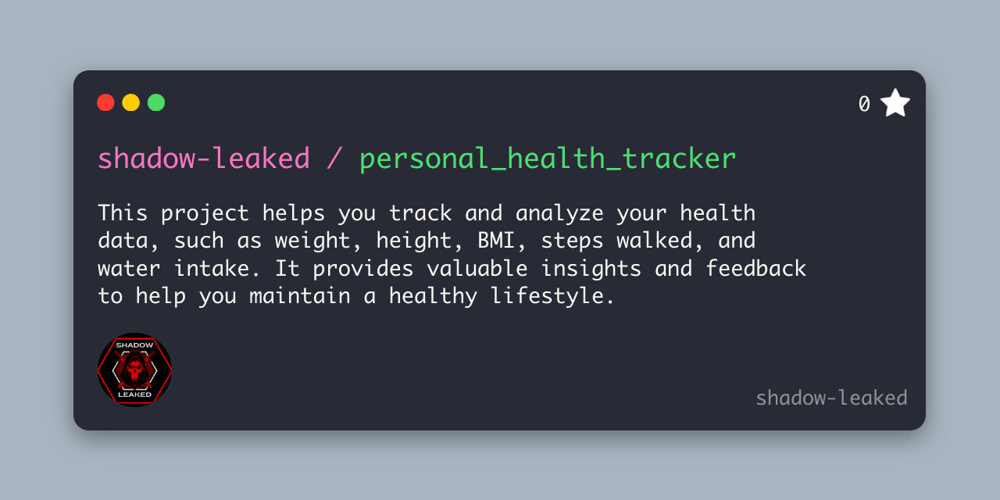

# Welcome to the Personal Health Tracker!

<div align="center">
  
</div>


This project helps you track and analyze your health data, such as weight, height, BMI, steps walked, and water intake. It provides valuable insights and feedback to help you maintain a healthy lifestyle. 

Feel free to explore, contribute, and improve your health with this tool!


## Personal Health Tracker

A health tracking application that allows users to input and monitor their health data, such as weight, height, BMI, steps walked, and water intake. The system validates the input data, stores it in a local SQLite database, and provides health analysis based on user input. The goal of this project is to track personal health metrics and provide feedback to the user to improve their overall well-being.

## Table of Contents

- [Features](#features)
- [Technologies Used](#technologies-used)
- [How to Run](#how-to-run)
- [Directory Structure](#directory-structure)
- [License](#license)
- [Contributors](#contributors)

## Features

- **User Health Data Tracking:** Allows users to input data such as weight, height, BMI, steps walked, and water intake.
- **Data Validation:** Validates input data to ensure that it follows the correct format and falls within healthy ranges.
- **Health Analysis:** Provides feedback on the user’s weight, activity levels, and hydration.
- **SQLite Database:** Stores user health data securely in a local SQLite database.
- **Data Deletion:** Includes functionality to delete all records from the database.

## Technologies Used

- **Python**: Programming language used for the core logic.
- **SQLite**: Database used to store user health data.
- **Pandas** (Optional): For data processing and analysis.
- **Tkinter** (Optional): For GUI development if needed.
- **Flask** (Optional): For creating a web interface for the application.

## How to Run

### Step 1: Clone the Repository
```bash
git clone https://github.com/shadow-leaked/personal_health_tracker.git
```
### Step 2: Navigate to the Project Directory
```bash
cd personal_health_tracker
```
### Step 3: Create a Virtual Environment (Optional but Recommended)
To avoid version conflicts, it’s good practice to create a virtual environment.

```bash
python -m venv venv
```
### Step 4: Activate the Virtual Environment
On Windows:
```bash
venv\Scripts\activate
```
On Mac/Linux:

```bash
source venv/bin/activate
```
### Step 5: Install Dependencies
Install all the required dependencies listed in requirements.txt:

```bash
pip install -r requirements.txt
```
### Step 6: Run the Application
Once all dependencies are installed, run the main Python script:

```bash
python main.py
```
### Step 7: Enter Data
The program will prompt you to enter various health-related data. After entering the data, the program will store it in the SQLite database and provide a health analysis summary.

### Directory Structure
```bash
personal_health_tracker/
├── main.py                # Main script to run the program
├── data_verification.py   # To validate data while inserting
├── delete_data.py         # To delete entire data
├── test_utils.py          # Unit tests for utility functions
├── health_data.db         # SQLite database for storing user health data
├── utils/                 # Helper functions
│   ├── db_utils.py        # Database operations
│   └── data_utils.py      # Data processing and validation
├── requirements.txt       # List of dependencies to install
└── README.md              # Project documentation
```
### requirements.txt
The following dependencies are required to run this project:

```bash
sqlite3
pandas
flask
```
### Note:
Make sure to adjust the requirements.txt if you add new dependencies to your project in the future.

### License
This project is licensed under the MIT License - see the [LICENSE](LICENSE) file for details.

### Contributors

<table>
<td><p align="center">Shadow Leaked<br><br></p><p align="center"><a href = "https://github.com/shadow-leaked"></a></p></td>

<td><p align="center">Rajjit Laishram<br><br></p><p align="center"><a href = "https://github.com/rajjitlai"></a></p>
</td>
</table>

### Acknowledgments
Thanks to Rajjit Laishram for his collaboration and contributions to this project.
Special thanks to all the contributors and open-source projects that made this possible.